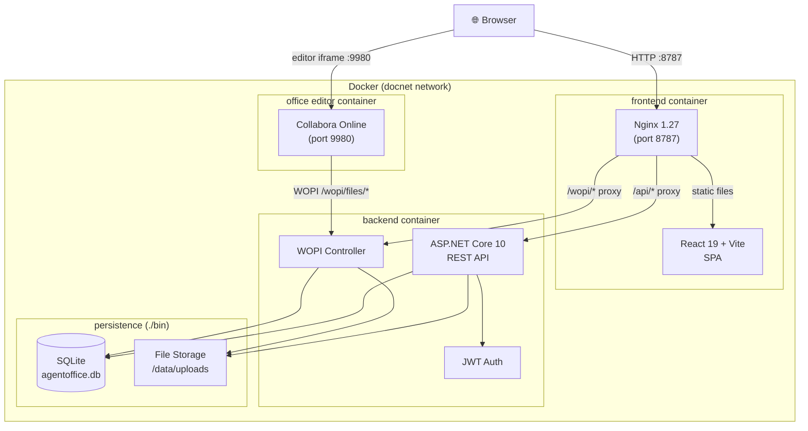

# Agent Office

[English](README.md) | [繁體中文](README.zh-TW.md)

A self-hosted collaborative Office workspace where human users and AI agents edit the same WOPI document through independent browser sessions. Collabora and OnlyOffice are interchangeable editor backends; Playwright is the built-in browser tool.

Tag an agent by name — `@Alice <task>` — in the chat room next to an open document, picking it from the tag list the composer offers. The backend turns that chat message into an `AgentTask` for the tagged agent (`@agent` still reaches whichever agent the workspace defaults to), the worker claims it, opens the same document in its own Chromium session, and the [pi](https://github.com/earendil-works/pi) agent runtime edits the document through a bounded office toolset: observe, type, drive editor dialogs, save, and verify the save reached the WOPI host. Progress, tool calls, and the final summary stream back into the same chat room over SignalR.

---

## Architecture



### Request Flow

```
Browser
  │
  ├─ Static assets (HTML/JS/CSS)
  │    └─► Nginx ──► React SPA (served from container)
  │
  ├─ REST API calls  /api/**
  │    └─► Nginx ──► ASP.NET Core ──► SQLite / disk
  │
  ├─ WOPI protocol   /wopi/**
  │    └─► Nginx ──► WopiController ──► disk (read/write file)
  │              ↑
  │         (called by editor)
  │
  └─ Editor iframe   :9980
       └─► Collabora Online
                 │
                 └─ calls WOPI back-channel ──► backend /wopi/**
```

---

## Tech Stack

| Layer | Technology |
|---|---|
| Frontend | React 19, Vite 6, TypeScript, TailwindCSS 3, React Router 7, i18next |
| Backend | ASP.NET Core 10, Entity Framework Core 9 (SQLite) |
| Auth | JWT Bearer (24h expiry) |
| Office Editing | WOPI protocol — Collabora Online or OnlyOffice |
| Container | Docker Compose, Nginx 1.27-alpine |

---

## Getting Started

### Docker (recommended)

```bash
# Collabora Online as editor
docker compose -f docker-compose.yml -f docker-compose.collabora.yml up -d

# OnlyOffice as editor
docker compose -f docker-compose.yml -f docker-compose.onlyoffice.yml up -d
```

Open **http://localhost:8788** in your browser. Collabora is exposed at `http://localhost:9981`; the OnlyOffice profile uses `http://localhost:8082`.

Copy `.env.example` to `.env` and replace its development credentials before exposing the service outside localhost. See [docs/ARCHITECTURE.md](docs/ARCHITECTURE.md) for runtime and trust-boundary details, and [docs/KNOWN-ISSUES.md](docs/KNOWN-ISSUES.md) for the weaknesses that are understood but not yet closed.

### Enabling the AI agent

The agent worker needs a model credential before it will do more than open the document. One
runtime is built in — [pi](https://github.com/earendil-works/pi) agent core, driving the document
through the office toolset as in-process function tools.

pi is a provider-neutral harness that runs on top of Anthropic, OpenAI or Google, so its model
setting names the vendor too — `anthropic:claude-opus-5`, `openai:gpt-5.3`, `google:gemini-3-pro`.
A bare model id is read as an Anthropic model, and the credential it needs is the key for whichever
vendor the model names.

On an Anthropic model it also takes a Claude subscription token, from the workspace agent's
*Claude OAuth token* field or the worker's `CLAUDE_CODE_OAUTH_TOKEN`. A `claude setup-token` value
is recognised by its `sk-ant-oat` prefix and authenticates as Claude Code; pi-ai does that handshake
itself.

- **Per deployment** — set the credential in `.env` (`ANTHROPIC_API_KEY` or
  `CLAUDE_CODE_OAUTH_TOKEN`, `OPENAI_API_KEY`, `GEMINI_API_KEY`), plus optionally `PI_MODEL`
  (default `anthropic:claude-opus-5`).
- **Per workspace** — create an agent on the *Agents* page with its own key, model, system prompt,
  and skills. A workspace agent overrides the deployment credential and supplies the model, turn
  limit, and timeout for tasks in that workspace.

Without a credential, tasks still run: the worker opens the document, reports the browser session,
and says in chat that no credential is configured.

A skill is versioned operating instructions, not code: a name, a version, and an `Instructions` body
that is appended to the agent's system prompt for every task it runs. Skills carry no scripts or
attachments and cannot grant capabilities — the office toolset is fixed, with no shell, filesystem,
or network tool — but any workspace member can write one, and its text steers the agent for everyone
in that workspace. [docs/KNOWN-ISSUES.md](docs/KNOWN-ISSUES.md) records what that does and does not
protect.

Then, in a document's chat room:

```
@Alice 把第一段的日期改成 2026 年 8 月，並在結尾加上一句致謝。
```

Typing `@` opens a picker of the workspace's enabled agents; pick one and the rest of the message
becomes its prompt. The task card in chat carries that agent's avatar and name next to the live tool
timeline, and the agent posts what it changed when it finishes.

### Local Development

**Backend**

```bash
cd backend/AgentOffice.API
dotnet run
# API at http://localhost:5000
```

**Frontend**

```bash
cd frontend
npm install
npm run dev
# UI at http://localhost:5173
```

> Vite proxies `/api/` and `/wopi/` to the backend automatically.

### Internationalization

The interface supports English and Traditional Chinese. The initial language is detected from the
browser, and the user's selection is saved in `localStorage` under `agentoffice-language`. Use the
language selector on the login/register pages or at the bottom of the sidebar to switch languages.

Translation resources live in `frontend/src/locales/en.ts` and `frontend/src/locales/zh-TW.ts`.
User-facing API errors are normalized through `frontend/src/lib/apiErrors.ts`, while chat and agent
task status messages use the same i18next resource tree. When adding interface text, add a key to
both locale files and render it with `useTranslation()` instead of hard-coding the string.

---

## API Overview

| Method | Path | Description |
|---|---|---|
| `POST` | `/api/auth/register` | Create account |
| `POST` | `/api/auth/login` | Get JWT token |
| `GET` | `/api/documents` | List documents |
| `POST` | `/api/documents` | Upload document |
| `GET` | `/api/documents/{id}` | Download document |
| `DELETE` | `/api/documents/{id}` | Delete document |
| `GET` | `/api/editors/{id}` | Get editor launch URL |
| `GET` | `/wopi/files/{id}` | WOPI CheckFileInfo |
| `GET` | `/wopi/files/{id}/contents` | WOPI GetFile |
| `POST` | `/wopi/files/{id}/contents` | WOPI PutFile |
| `GET` | `/api/workspaces/{id}/messages` | Chat history |
| `POST` | `/api/workspaces/{id}/messages` | Send a chat message (`@<agent name> …` dispatches a task) |
| `GET` | `/api/workspaces/{id}/agent-tasks` | List agent tasks |

Worker-only endpoints, authenticated with `X-Agent-Worker-Key`:

| Method | Path | Description |
|---|---|---|
| `POST` | `/internal/agent-tasks/claim` | Claim the oldest queued task |
| `GET` | `/internal/agent-tasks/{id}/context` | Document, agent profile, skills, recent chat |
| `POST` | `/internal/agent-tasks/{id}/events` | Append a tool/status event |
| `POST` | `/internal/agent-tasks/{id}/messages` | Post into the workspace chat as the agent |
| `POST` | `/internal/agent-tasks/{id}/finish` | Complete or fail the task |

---

## Project Structure

```
agent-office/
├── backend/AgentOffice.API/
│   ├── Controllers/        # Auth, Documents, Editors, Wopi
│   ├── Services/           # AuthService, DocumentService, WopiTokenService
│   ├── Models/             # User, Document, WopiModels
│   ├── Data/               # AppDbContext (EF Core)
│   └── Dockerfile
├── agent-worker/
│   └── src/
│       ├── browser/        # BrowserTool + Collabora/OnlyOffice drivers
│       ├── runtime/        # pi agent runtime over the shared office toolset
│       └── index.ts        # claim → open document → run runtime → report
├── frontend/
│   ├── src/
│   │   ├── api/            # Axios clients (auth, documents)
│   │   ├── components/     # DocumentCard, UploadModal, WopiEditor, Layout
│   │   ├── contexts/       # AuthContext
│   │   ├── locales/        # English and Traditional Chinese translations
│   │   ├── pages/          # Home, Editor, Login, Register
│   │   ├── i18n.ts         # Language detection and i18next initialization
│   │   └── types/
│   ├── nginx.conf
│   └── Dockerfile
├── skills/                 # Versioned skill sources (SKILL.md), authored by hand
├── docs/                   # ARCHITECTURE.md, KNOWN-ISSUES.md
├── docker-compose.yml
├── docker-compose.collabora.yml
└── docker-compose.onlyoffice.yml
```
