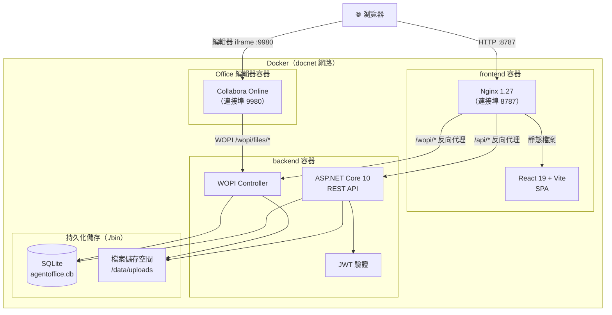

# Agent Office

[English](README.md) | [繁體中文](README.zh-TW.md)

Agent Office 是一套可自行託管的協作式 Office 工作區，讓使用者與 AI Agent 透過各自獨立的瀏覽器工作階段，共同編輯同一份 WOPI 文件。系統可選用 Collabora Online 或 OnlyOffice 作為編輯器後端，並以 Playwright 作為內建瀏覽器工具。

在文件旁的聊天室輸入 `@Alice <任務>` 即可指定 Agent。編輯器會提供 Agent 選單；後端把訊息轉換為該 Agent 的 `AgentTask`（`@agent` 仍會交給工作區的預設 Agent），worker 接取任務後，會在獨立的 Chromium 工作階段開啟同一份文件。內建的 [pi](https://github.com/earendil-works/pi) Agent runtime 會透過受限的 Office 工具集觀察畫面、輸入內容、操作編輯器對話框、儲存文件，並確認變更已送達 WOPI 主機。執行進度、工具呼叫與最終摘要會透過 SignalR 即時顯示在同一個聊天室中。

---

## 系統架構



### 請求流程

```text
瀏覽器
  │
  ├─ 靜態資源（HTML／JS／CSS）
  │    └─► Nginx ──► React SPA
  │
  ├─ REST API 請求  /api/**
  │    └─► Nginx ──► ASP.NET Core ──► SQLite／磁碟
  │
  ├─ WOPI 協定  /wopi/**
  │    └─► Nginx ──► WopiController ──► 磁碟（讀寫檔案）
  │              ↑
  │          （由編輯器呼叫）
  │
  └─ 編輯器 iframe  :9980
       └─► Collabora Online
                 │
                 └─ WOPI 反向呼叫 ──► backend /wopi/**
```

---

## 技術棧

| 層級 | 技術 |
|---|---|
| 前端 | React 19、Vite 6、TypeScript、TailwindCSS 3、React Router 7、i18next |
| 後端 | ASP.NET Core 10、Entity Framework Core 9（SQLite） |
| 身分驗證 | JWT Bearer（24 小時有效期） |
| Office 編輯 | WOPI 協定，可選 Collabora Online 或 OnlyOffice |
| 容器 | Docker Compose、Nginx 1.27-alpine |

---

## 快速開始

### Docker（建議方式）

```bash
# 使用 Collabora Online
docker compose -f docker-compose.yml -f docker-compose.collabora.yml up -d

# 使用 OnlyOffice
docker compose -f docker-compose.yml -f docker-compose.onlyoffice.yml up -d
```

在瀏覽器開啟 **http://localhost:8788**。Collabora 使用 `http://localhost:9981`；OnlyOffice 設定使用 `http://localhost:8082`。

將 `.env.example` 複製為 `.env`。若要讓 localhost 以外的裝置存取服務，請先替換其中的開發用憑證。執行環境與信任邊界的詳細說明請參閱 [docs/ARCHITECTURE.md](docs/ARCHITECTURE.md)。

### 啟用 AI Agent

Agent worker 必須取得模型憑證，才能實際修改文件。系統內建 [pi](https://github.com/earendil-works/pi) Agent core，並以程序內工具的方式操作共用 Office 工具集。

pi 是供應商中立的執行框架，可使用 Anthropic、OpenAI 或 Google 模型，因此模型設定必須包含供應商，例如 `anthropic:claude-opus-5`、`openai:gpt-5.3`、`google:gemini-3-pro`。未包含供應商的模型 ID 會視為 Anthropic 模型；系統會依模型供應商選用對應憑證。

Anthropic 模型也支援 Claude 訂閱權杖，可在工作區 Agent 的「Claude OAuth 權杖」欄位或 worker 的 `CLAUDE_CODE_OAUTH_TOKEN` 設定。以 `sk-ant-oat` 開頭的 `claude setup-token` 會由 pi-ai 以 Claude Code 流程進行驗證。

- **部署層級**：在 `.env` 設定 `ANTHROPIC_API_KEY`、`CLAUDE_CODE_OAUTH_TOKEN`、`OPENAI_API_KEY` 或 `GEMINI_API_KEY`，並可選擇設定 `PI_MODEL`；預設值為 `anthropic:claude-opus-5`。
- **工作區層級**：在「Agents」頁面建立 Agent，設定專屬金鑰、模型、系統提示詞與技能。工作區 Agent 會覆蓋部署層級憑證，並決定該工作區任務使用的模型、最大回合數與逾時時間。

若未設定憑證，任務仍會啟動：worker 會開啟文件、回報瀏覽器工作階段，並在聊天室說明尚未設定模型憑證。

技能是有版本的操作指示，不是程式碼。每個技能包含名稱、版本與 `Instructions` 內容，並會附加到 Agent 每次任務的系統提示詞。技能不包含腳本或附件，也無法增加 Agent 權限；Office 工具集固定且不提供 shell、檔案系統或一般網路工具。

接著在文件聊天室輸入：

```text
@Alice 把第一段的日期改成 2026 年 8 月，並在結尾加上一句致謝。
```

輸入 `@` 會顯示工作區中已啟用的 Agent。選取 Agent 後，訊息的其餘部分會成為任務提示詞。聊天室中的任務卡片會顯示該 Agent 的名稱、頭像、即時工具執行進度，以及完成後的變更摘要。

### 本機開發

**後端**

```bash
cd backend/AgentOffice.API
dotnet run
# API：http://localhost:5000
```

**前端**

```bash
cd frontend
npm install
npm run dev
# UI：http://localhost:5173
```

> Vite 會自動將 `/api/` 與 `/wopi/` 代理至後端。

### 多語系

介面支援英文與繁體中文。系統會依瀏覽器語言選擇初始語系，並將使用者的選擇儲存在 localStorage 的 `agentoffice-language`。登入／註冊頁面右上角與側邊欄底部皆可切換語言。

翻譯資源位於：

- `frontend/src/locales/en.ts`
- `frontend/src/locales/zh-TW.ts`

使用者會看到的 API 錯誤由 `frontend/src/lib/apiErrors.ts` 統一轉換；聊天室及 Agent 任務狀態也使用同一套 i18next 資源。新增介面文字時，請同時在兩個語系檔加入翻譯 key，並透過 `useTranslation()` 顯示，避免直接寫死文字。

---

## API 概覽

| 方法 | 路徑 | 說明 |
|---|---|---|
| `POST` | `/api/auth/register` | 建立帳號 |
| `POST` | `/api/auth/login` | 取得 JWT token |
| `GET` | `/api/documents` | 列出文件 |
| `POST` | `/api/documents` | 上傳文件 |
| `GET` | `/api/documents/{id}` | 下載文件 |
| `DELETE` | `/api/documents/{id}` | 刪除文件 |
| `GET` | `/api/editors/{id}` | 取得編輯器啟動 URL |
| `GET` | `/wopi/files/{id}` | WOPI CheckFileInfo |
| `GET` | `/wopi/files/{id}/contents` | WOPI GetFile |
| `POST` | `/wopi/files/{id}/contents` | WOPI PutFile |
| `GET` | `/api/workspaces/{id}/messages` | 取得聊天紀錄 |
| `POST` | `/api/workspaces/{id}/messages` | 傳送訊息；`@<Agent 名稱> …` 會派送任務 |
| `GET` | `/api/workspaces/{id}/agent-tasks` | 列出 Agent 任務 |

Worker 專用端點以 `X-Agent-Worker-Key` 驗證：

| 方法 | 路徑 | 說明 |
|---|---|---|
| `POST` | `/internal/agent-tasks/claim` | 接取最早排入佇列的任務 |
| `GET` | `/internal/agent-tasks/{id}/context` | 取得文件、Agent 設定、技能與最近聊天內容 |
| `POST` | `/internal/agent-tasks/{id}/events` | 新增工具或狀態事件 |
| `POST` | `/internal/agent-tasks/{id}/messages` | 以 Agent 身分傳送工作區訊息 |
| `POST` | `/internal/agent-tasks/{id}/finish` | 完成任務或標記失敗 |

---

## 專案結構

```text
agent-office/
├── backend/AgentOffice.API/
│   ├── Controllers/        # Auth、Documents、Editors、Wopi
│   ├── Services/           # 驗證、文件、工作區與 WOPI 服務
│   ├── Models/             # 使用者、文件、工作區與任務模型
│   ├── Data/               # AppDbContext（EF Core）
│   └── Dockerfile
├── agent-worker/
│   └── src/
│       ├── browser/        # BrowserTool 與 Office 編輯器 driver
│       ├── runtime/        # pi Agent runtime 與 Office 工具集
│       └── index.ts        # 接取任務 → 開啟文件 → 執行 → 回報
├── frontend/
│   ├── src/
│   │   ├── api/            # Axios API clients
│   │   ├── components/     # 文件、聊天、編輯器與版面元件
│   │   ├── contexts/       # AuthContext、WorkspaceContext
│   │   ├── locales/        # 英文與繁體中文翻譯
│   │   ├── pages/          # 首頁、工作區、編輯器、登入與註冊
│   │   ├── i18n.ts         # 語言偵測與 i18next 初始化
│   │   └── types/
│   ├── nginx.conf
│   └── Dockerfile
├── skills/                 # 以 SKILL.md 維護的技能來源
├── docs/                   # 架構文件
├── docker-compose.yml
├── docker-compose.collabora.yml
└── docker-compose.onlyoffice.yml
```
